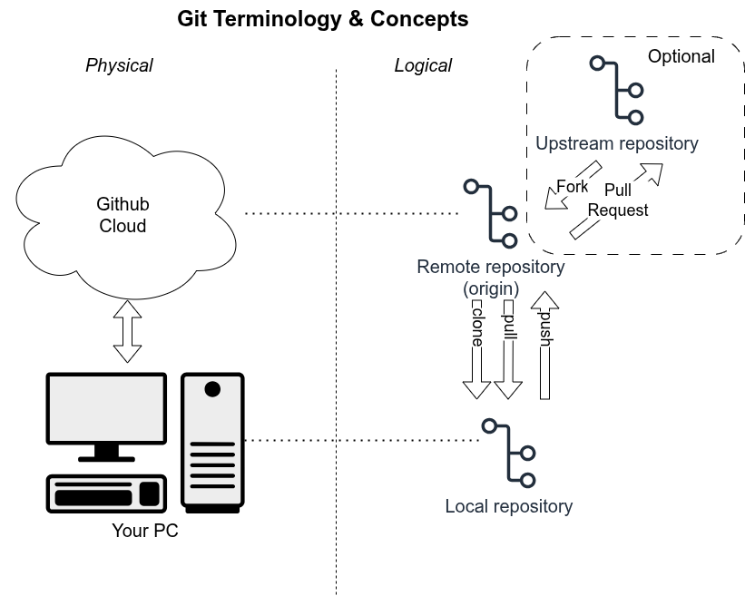

# Git and Github - zero to hero in 60 minutes

- Scope: how to do common operations for common scenarios
- Slideset at https://docs.google.com/presentation/d/1MmLIxKv2Xzdbflz_UGx9gGhtgEvau4lHrMYWy0Sb6FI/edit?usp=sharing

## What is git + github

- github keeps a copy of your code repository on your PC in the cloud
- git manipulates the code repository version history, and provides for
syncing it with the cloud version

### Concepts & Terminology



- Git tracks diffs between versions - it doesn't keep a complete (or partial)
copy of the directory tree between versions (except for binary files).
  - Keeps incremental commit sizes small.
- Git can track binary files like schematics, 3D models, and other binary
files.

## Why use git + github?

Robotics centrally includes software/firmware. You need to use proper
techniques in its development. Git enables good techniques, but there's
some overhead in managing the local (and optional remote) repos. Here's how:

- Cloud backup of your code saves you if you accidentally delete your
code folder on your PC. 
  - It's a lot harder to delete a github repo than
a directory.
- Save intermediate "working states" of your code, and easily get back
to them for testing

- Switch between multiple configs - e.g. between two robot configs, or
two sensor configs

- Avoid "multiple copies of code directories" syndrome. 
  - Easily make
changes to test something without changing the known-good
version (difficult without multiple copies if not using git)

- Document changes (vs. documenting lines of code) with comments in the
commit message.
  - Supports long-term project archeology - months or years
later you can see not just what you changed but why.

- Sync your code directory between multiple machines. Get warnings about
conflicting changes between them.
  - Scenarios: same codebase on PC and on Raspberry Pi
used for different purposes

- Fearless refactoring or trying out new libraries/features. Git encourages
bold changes.
  - Start a major refactoring on a branch and abandon it if
it doesn't work out. Safety net gives you confidence to try big changes.

- Maintain a "Release" version that's always ready to run, while you develop
on a branch.
  - Helps you quickly isolate whether a problem that arises in development
is due to the SW change or if HW broke.

- Maintain version control of HW files (3D cad models, PCB designs etc), as well
as software & firmware.
  - Get all the benefits above for HW

## Tools, Getting Started

Git is multi-platform - Windows, Linux, MacOS, x86 & Arm

- Install git on your platform. Check you have gitk (it should come with it)
  - You don't need the github cli (gh). Use the website instead.
- If you use VS Code, install the git extension
- If you don't have a github account, set one up at github.com
  - You'll have to set up ssh keys and 2FA

### Edit the .gitconfig file in your home directory

The .gitconfig file in your home directory contains global settings.

- I suggest meld for a tool to diff files and perform 3-way merges
  - Available on Windows and Linux
```
[user]
        email = paul.bouchier@gmail.com
        name = Paul Bouchier
[alias]
    s = status
    co = checkout
[diff]
    tool = meld
[difftool]
    prompt = false
[difftool "meld"]
    cmd = meld "$LOCAL" "$REMOTE"
[merge]
    tool = meld
[mergetool "meld"]
    # Choose one of these 2 lines (not both!)
    cmd = meld "$LOCAL" "$MERGED" "$REMOTE" --output "$MERGED"
    # cmd = meld "$LOCAL" "$BASE" "$REMOTE" --output "$MERGED"
```

## Demos
Assume you have created an account

- Create & Clone New Repo
- Copy some local content into the new repo, & edit README.md
- View local status (git status + gitk) - git status + vs-code + gitk + git difftool
- Stage & commit and push it to github.

## Advanced usage

- git remote -v
- .gitignore
- cherry-pick
- revert (with & without push to remote)
- blame!
- squash
- bisect